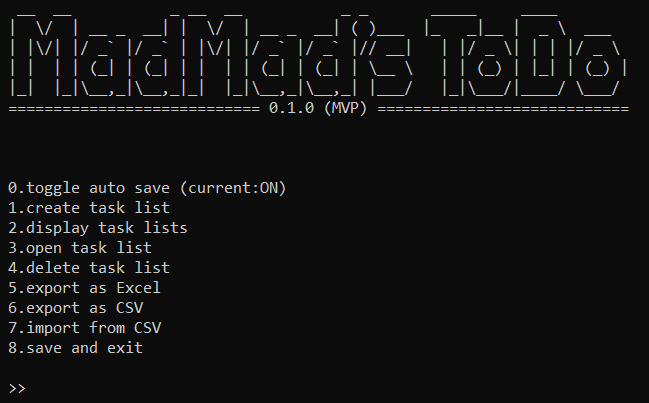
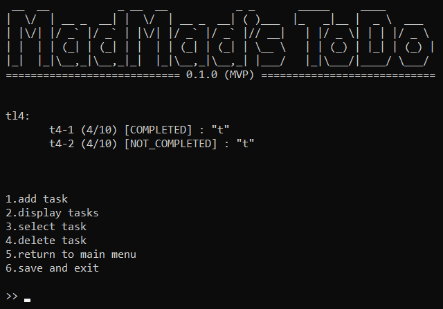
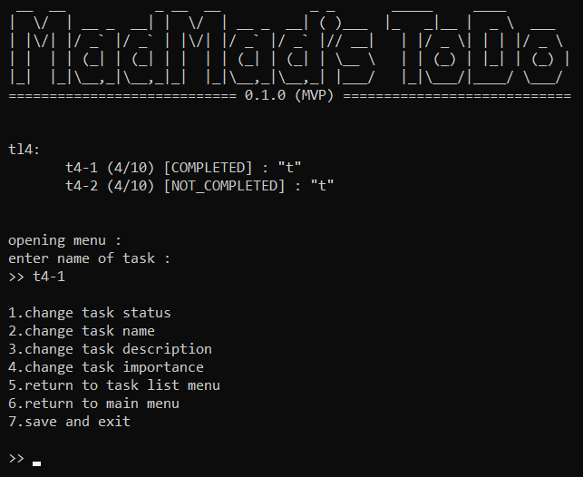

# 📝 MadMad ToDo App
a simple and interactive CLI-based ToDo app built with Python.  
Designed to help you manage multiple task lists and tasks with ease.

---

## 📌 Version
**Current Version:** `0.1.0 (MVP)`  
**Python:** >=3.10.0 (tested on 3.13.1)

---

## 🎯 Features
- 🗂 create, view, and delete multiple task lists
- ✅ add, view, and delete tasks with **name, description, and importance (1-10)**
- 🔄 toggle task status (completed|not completed)
- 💾 auto-save functionality (can be toggled on|off)
- 📤 export task lists as **CSV** or **Excel** files
- 📥 JSON-based data persistence
- 🎨 clean, text-based UI with intuitive menus





---

## ⚙️ How It Works ❓
1. create **task lists** to organize your tasks by project or category
2. each task includes:
   - **Name:** quick identifier
   - **Description:** detailed information
   - **Importance:** priority level (1-10)
   - **Status:** completed ✓ or not completed ✗
3. manage everything through simple numbered menus
4. data automatically saves and loads between sessions 

---

## 🚀 Installation
```bash
# Clone the repository
git clone https://github.com/HiDMadMad/madmad-todo.git
cd madmad-todo

# Install dependencies
pip install -r requirements.txt

# Run the app
python app/app.py
```
---

## 📖 Quick Start
1.run the app: python app/app.py
2.press 1 to create your first task list
3.enter a name ("Work Tasks")
4.press 3 to open the task list
5.press 1 to add your first task
6.enter task details (name, description, importance)
7.press 8 to save and exit

---

## 🛠️ Current Status

✔ core features are implemented
👨‍💻 more features are still in development

---

## 📁 Project Structure

madmad-todo/
├── app/
│   ├── app.py           # main entry point
│   ├── models.py        # data models
│   ├── ui.py            # user interface
│   ├── messages.py      # all messages
│   └── data/  
│       ├── your_todo_data.json
│       └── exported_data/
├── assets/
│   └── screen-shots/
├── .gitignore
├── LICENSE
├── README.md
└── requirements.txt

---

## 🙏 Contributions
feedback, ideas, and pull requests are welcome!
feel free to open an issue or contribute.

---

## 📜 License
this project is licensed under the MIT License
copyright © 2025 HiDMadMad