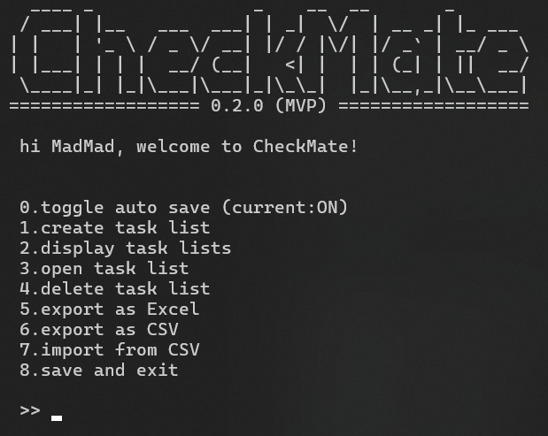
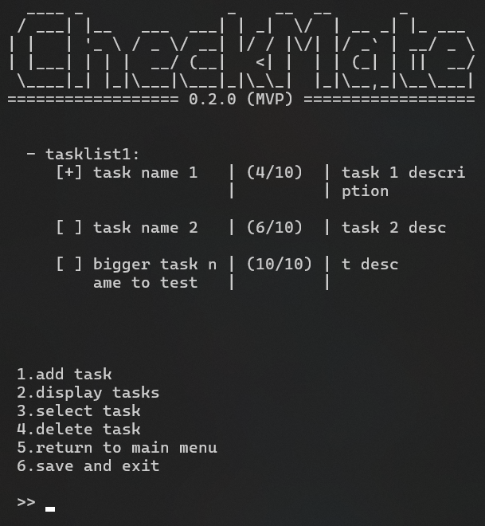
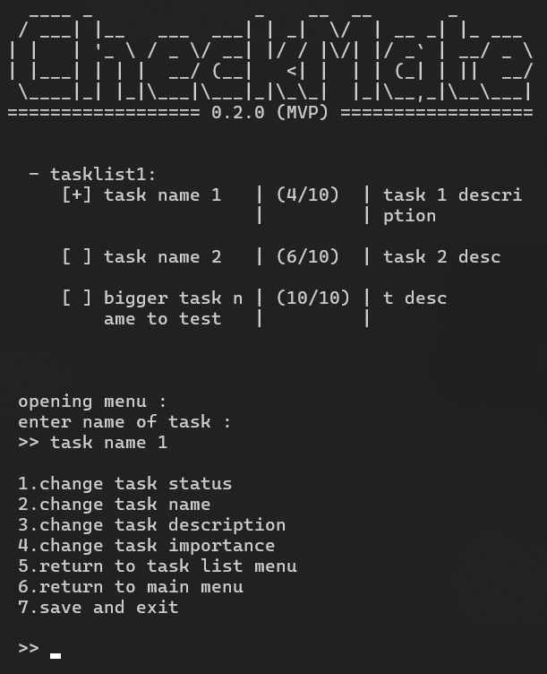

# CheckMate
a simple and interactive CLI-based ToDo app built with Python.  
designed to help you manage multiple task lists and tasks with ease.

[-green)](https://github.com/HiDMadMad/madmad-todo/releases)
[](https://opensource.org/licenses/MIT)
[](https://www.python.org/downloads/)

---

## Features
- 🗂 create, view, and delete multiple task lists
- ✅ add, view, and delete tasks with **name, description, and importance (1-10)**
- 🔄 toggle task status (completed|not completed)
- 💾 auto-save functionality (can be toggled on|off)
- 📤 export task lists as **CSV** or **Excel** files
- 📥 JSON-based data persistence
- 🎨 clean, text-based UI with intuitive menus

---

## Screenshots
| Main Menu | Task List Menu | Task Menu |
|:---:|:---:|:---:|
|  |  |  |

---

## How It Works ❓
1. create **task lists** to organize your tasks by project or category
2. each task includes:
   - **Name:** quick identifier
   - **Description:** detailed information
   - **Importance:** priority level (1-10)
   - **Status:** completed [+] or not completed [ ]
3. manage everything through simple numbered menus
4. data automatically saves and loads between sessions 

---

## Installation
### 🖱️ Quick Start (Windows/Linux)
1. download the latest release: [**CheckMate-v0.2.0**](https://github.com/0xMadMad/CheckMate/releases/latest)
2. extract the downloaded zip and keep the data/ folder next to the builds
4. run it directly. no installation or Python required

> on Linux, you may need to make the binary executable first:
> ```
> chmod +x CheckMate-v0.2.0
> ./CheckMate-v0.2.0
> ```

### ⌨️ Run from Source
```bash
# clone the repository
git clone https://github.com/0xMadMad/check-mate.git
cd check-mate

# install dependencies
pip install -r requirements.txt

# run the app
python src/app.py
```

---

## Reference
1. run the app: `python src/app.py`
2. press 1 to create your first task list
3. enter a name ("Work Tasks")
4. press 3 to open the task list
5. press 1 to add your first task
6. enter task details (name, description, importance)
7. press 8 to save and exit

---

## Current Status

✔ core features are implemented <br>
👨‍💻 more features are still in development

---

## Project Structure
```
check-mate/
├── src/
│   ├── app.py           # main entry point
│   ├── models.py        # data models
│   ├── core.py          # menus, I/O, data persistence
│   ├── messages.py      # all messages
|   ├── update_build.py  # build updater
│   └── data/
│       ├── your_todo_data.json
|       ├── your_todo_data.json.backup
│       └── exported-data/
├── assets/
|   ├── icon.png
|   ├── icon.ico
│   └── screen-shots/
|       ├── v0.1.0/
|       └── v0.2.0/
├── .gitignore
├── LICENSE
├── README.md
└── requirements.txt
```

---

## Contributions
feedback, ideas, and pull requests are welcome! <br>
feel free to open an issue or contribute.

---

## 📜 License
this project is licensed under the MIT License <br>
copyright © 2025 HiDMadMad
